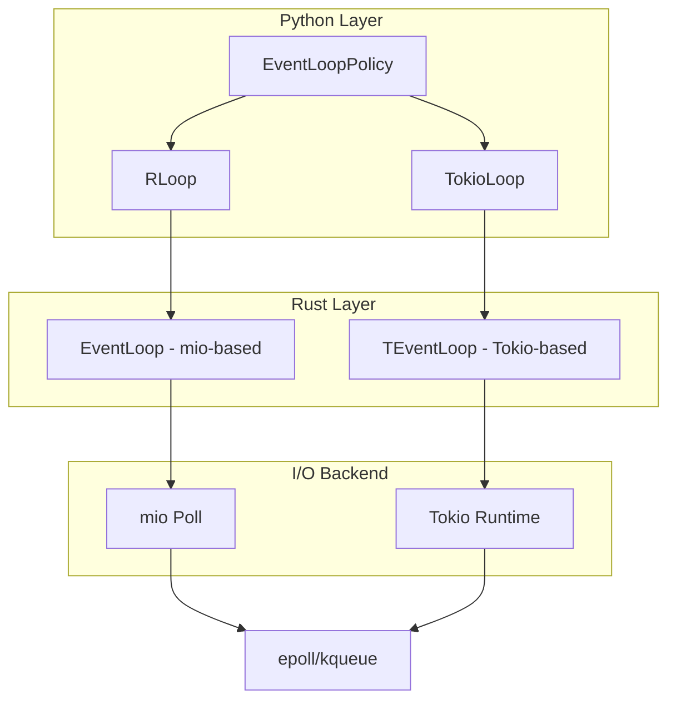
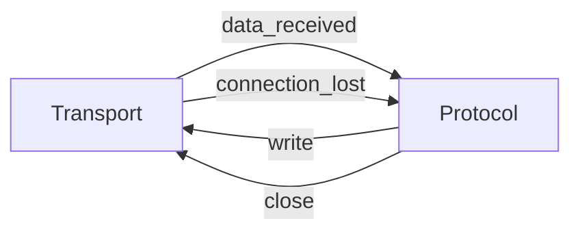
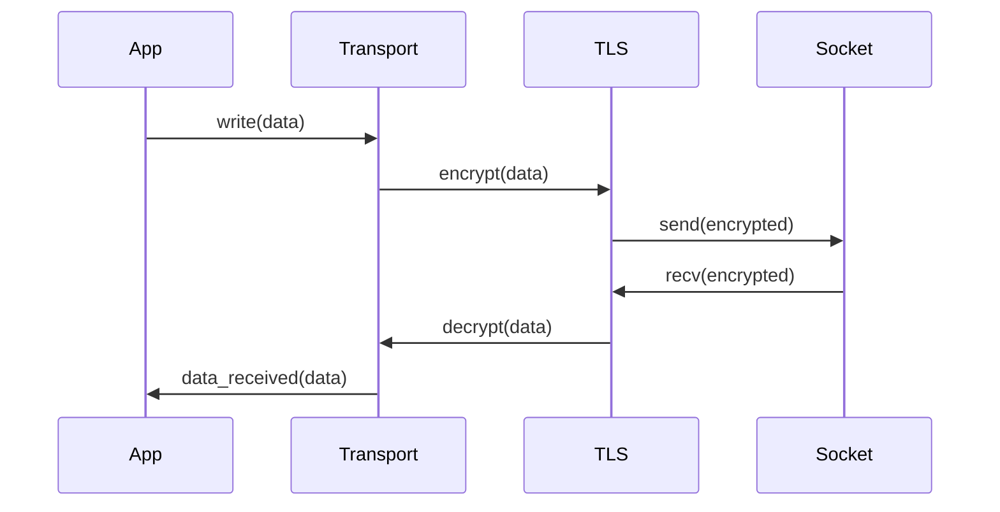
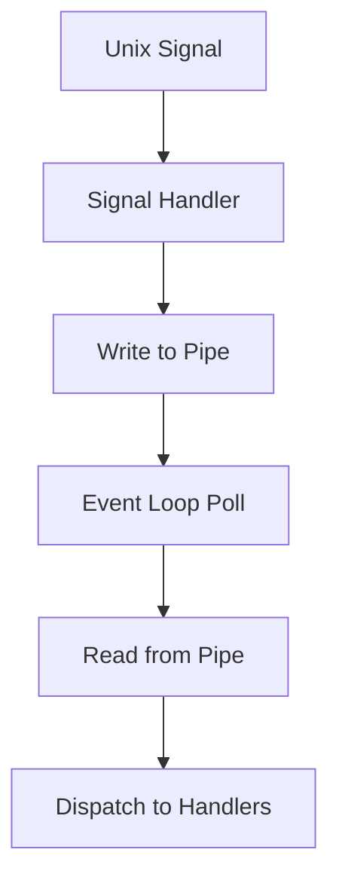

# TokioLoop Memory Bank

**Last Updated:** 2026-01-26  
**Project Version:** 0.2.0  
**Status:** Alpha Development (Work in Progress)

---

## Executive Summary

TokioLoop is a high-performance AsyncIO event loop implementation in Rust, providing two distinct event loop implementations:
1. **RLoop** - Original mio-based event loop (mature, working)
2. **TokioLoop** - Tokio-based event loop (ongoing development, will replace RLoop)

The project aims to provide a drop-in replacement for Python's standard asyncio event loop with significantly better performance, particularly for I/O-bound applications. Benchmarks show RLoop outperforming both asyncio and uvloop in many scenarios.

**Critical Note:** RLoop will be removed from the codebase once TokioLoop matures. All new development should focus on TokioLoop.

---

## Project Structure

```
tokioloop/
├── src/                    # Rust source code
│   ├── lib.rs             # Module initialization
│   ├── event_loop.rs      # RLoop implementation (mio-based)
│   ├── tokio_event_loop.rs # TokioLoop implementation (Tokio-based)
│   ├── handles.rs         # Callback and timer handles
│   ├── tcp.rs             # TCP transport implementation
│   ├── tokio_tcp.rs       # Tokio TCP transport
│   ├── udp.rs             # UDP transport implementation
│   ├── tokio_udp.rs       # Tokio UDP transport
│   ├── ssl.rs             # SSL/TLS support (rustls)
│   ├── server.rs          # Server implementations
│   ├── io.rs              # I/O source abstraction
│   ├── sock.rs            # Socket wrapper
│   ├── time.rs            # Timer utilities
│   ├── log.rs             # Logging infrastructure
│   ├── py.rs              # Python integration utilities
│   └── utils.rs           # Utility functions
├── rloop/                 # Python bindings
│   ├── __init__.py        # Public API exports
│   ├── loop.py            # Event loop Python implementation
│   ├── _rloop.pyi         # Type stubs
│   ├── server.py          # Server wrapper
│   ├── futures.py         # Future implementations
│   ├── exc.py             # Exception handling
│   ├── subprocess.py      # Subprocess support
│   ├── transports.py      # Transport abstractions
│   └── _compat.py         # Compatibility layer
├── tests/                 # Test suite
│   ├── conftest.py        # Test configuration
│   ├── test_handles.py    # Handle tests
│   ├── test_signals.py    # Signal handling tests
│   ├── test_sockets.py    # Socket tests
│   ├── test_tokio_import.py # TokioLoop import tests
│   ├── tcp/               # TCP-specific tests
│   ├── udp/               # UDP-specific tests
│   └── ssl_/              # SSL/TLS tests
├── benchmarks/            # Performance benchmarks
│   ├── benchmarks.py      # Benchmark runner
│   ├── client.py          # Benchmark client
│   ├── server.py          # Benchmark server
│   └── results/           # Benchmark results
├── Cargo.toml             # Rust dependencies
├── pyproject.toml         # Python project configuration
├── build.rs               # Build script
└── README.md              # Project documentation
```

---

## Critical Files and Dependencies

### Core Rust Modules

| File | Purpose | Maturity |
|------|---------|----------|
| [`src/lib.rs`](src/lib.rs:1) | Module initialization, version management | Working |
| [`src/event_loop.rs`](src/event_loop.rs:1) | RLoop core implementation (mio-based) | Working |
| [`src/tokio_event_loop.rs`](src/tokio_event_loop.rs:1) | TokioLoop core implementation (Tokio-based) | Ongoing |
| [`src/handles.rs`](src/handles.rs:1) | Callback and timer handle abstractions | Working |
| [`src/tcp.rs`](src/tcp.rs:1) | TCP transport with TLS support | Working |
| [`src/udp.rs`](src/udp.rs:1) | UDP transport implementation | Working |
| [`src/ssl.rs`](src/ssl.rs:1) | SSL/TLS configuration (rustls) | Working |
| [`src/server.rs`](src/server.rs:1) | Server implementations for both loops | Working |

### Python Bindings

| File | Purpose | Maturity |
|------|---------|----------|
| [`rloop/__init__.py`](rloop/__init__.py:1) | Public API, factory functions | Working |
| [`rloop/loop.py`](rloop/loop.py:1) | Event loop Python layer | Working |
| [`rloop/server.py`](rloop/server.py:1) | Server wrapper class | Working |
| [`rloop/_rloop.pyi`](rloop/_rloop.pyi:1) | Type stubs for IDE support | Working |

### Key Dependencies

**Rust Dependencies:**
- `mio` (v1.1) - I/O event notification for RLoop
- `tokio` (v1.0) - Async runtime for TokioLoop
- `pyo3` (v0.27) - Python bindings
- `rustls` (v0.23) - TLS implementation
- `papaya` (v0.2) - Lock-free concurrent data structures
- `socket2` (v0.6) - Low-level socket operations
- `async-channel` (v2.1) - Async channels for TokioLoop

**Python Dependencies:**
- `pytest` (v9.0.2) - Testing framework
- `pytest-asyncio` (v1.3.0) - Async test support
- `uvloop` - Benchmark comparison

---

## Architectural Patterns

### 1. Dual Event Loop Architecture

The project maintains two parallel event loop implementations:



**RLoop (mio-based):**
- Uses `mio` for cross-platform I/O event notification
- Single-threaded event loop with manual polling
- Direct file descriptor management
- More mature, feature-complete

**TokioLoop (Tokio-based):**
- Uses `tokio` async runtime
- Multi-threaded worker pool
- Async/await based task scheduling
- Ongoing development, will replace RLoop

### 2. Handle-Based Callback System

Both loops use a unified handle system for callbacks:

```rust
pub trait Handle {
    fn run(&self, py: Python, event_loop: &EventLoop, state: &mut EventLoopRunState);
    fn cancelled(&self) -> bool { false }
}
```

**Handle Types:**
- `CBHandle` - Generic callback with arguments
- `CBHandleNoArgs` - Callback without arguments
- `CBHandleOneArg` - Callback with single argument
- `TimerHandle` - Delayed callback
- `TCPReadHandle` / `TCPWriteHandle` - I/O callbacks
- `UDPReadHandle` / `UDPWriteHandle` - I/O callbacks

### 3. Transport-Protocol Pattern

Following asyncio's transport-protocol separation:



**Transport Responsibilities:**
- Low-level I/O operations
- Buffer management
- Flow control (watermarks)
- Connection lifecycle

**Protocol Responsibilities:**
- Application logic
- Data processing
- Connection state management

### 4. Lock-Free Concurrency

Uses `papaya` for lock-free concurrent data structures:

```rust
handles_io: papaya::HashMap<Token, IOHandle>,
tcp_transports: papaya::HashMap<usize, Py<TCPTransport>>,
udp_transports: papaya::HashMap<usize, Py<UDPTransport>>,
```

**Benefits:**
- Reduced contention in multi-threaded scenarios
- Better performance under high load
- Safe concurrent access from Python threads

### 5. TLS Integration Pattern

SSL/TLS is integrated at the transport layer:



**Key Features:**
- Transparent TLS encryption/decryption
- Handshake completion tracking
- Graceful TLS close alerts
- Configurable TLS versions (1.2, 1.2+, 1.3)

### 6. Signal Handling Architecture

Unix signals are handled via a self-pipe pattern:



**Implementation:**
- Signal handlers write signal numbers to a pipe
- Event loop monitors pipe for readability
- Signals are dispatched to registered Python callbacks
- Thread-safe signal handling

---

## Coding Standards

### Rust Code Style

**Naming Conventions:**
- Types: `PascalCase` (e.g., `EventLoop`, `TCPTransport`)
- Functions: `snake_case` (e.g., `tcp_stream_add`, `handle_io_py`)
- Constants: `SCREAMING_SNAKE_CASE` (e.g., `TLS12_ONLY`)
- Private fields: `snake_case` with leading underscore for Python-exposed fields

**Error Handling:**
- Use `anyhow::Result` for application errors
- Use `PyErr` for Python-facing errors
- Always handle `WouldBlock` and `Interrupted` I/O errors
- Log errors before converting to Python exceptions

**Concurrency:**
- Use `atomic::AtomicBool` for simple flags
- Use `papaya::HashMap` for concurrent maps
- Use `Arc<RwLock<T>>` for complex shared state
- Prefer lock-free structures when possible

**Memory Management:**
- Use `Py<T>` for Python object references
- Use `RefCell<T>` for interior mutability
- Avoid `unsafe` except for FFI boundaries
- Use `#[pyclass(frozen)]` for immutable Python classes

### Python Code Style

**Configuration:**
- Line length: 120 characters
- Single quotes for strings
- Double quotes for docstrings
- Type hints required for public APIs

**Linting Rules (ruff):**
- Enabled: B, C4, C90, I, N, Q, RUF100, S, W
- Ignored: B008, B009, B034, B904, E501, N818, S101

**Testing:**
- Use `pytest` with `pytest-asyncio`
- Parametrize tests for multiple event loops
- Use fixtures for common setup
- Test both RLoop and TokioLoop

### Documentation Standards

**Rust Documentation:**
- Public functions must have doc comments
- Use `///` for documentation
- Include examples for complex APIs
- Document safety invariants for `unsafe` code

**Python Documentation:**
- Use docstrings for all public classes and functions
- Include type hints in signatures
- Document exceptions that may be raised
- Provide usage examples

---

## Feature Maturity Matrix

### Core Event Loop Features

| Feature | RLoop | TokioLoop | Notes |
|---------|-------|-----------|-------|
| Basic event loop | ✅ Working | ✅ Working | Both implement core asyncio API |
| Callback scheduling | ✅ Working | ✅ Working | `call_soon`, `call_later`, `call_at` |
| Timer management | ✅ Working | ✅ Working | Absolute timestamp-based timers |
| Future/Task support | ✅ Working | ✅ Working | Uses stdlib futures |
| Signal handling | ✅ Working | 🔄 Ongoing | Unix signals via self-pipe |
| Thread safety | ✅ Working | ✅ Working | `call_soon_threadsafe` |

### I/O Features

| Feature | RLoop | TokioLoop | Notes |
|---------|-------|-----------|-------|
| TCP sockets | ✅ Working | 🔄 Ongoing | Client and server |
| UDP sockets | ✅ Working | 🔄 Ongoing | Datagram endpoints |
| SSL/TLS | ✅ Working | 🔄 Ongoing | rustls-based |
| Unix Domain Sockets | ❌ Not Implemented | ❌ Planned | Unix-only |
| Pipe I/O | ✅ Working | ❌ Planned | Subprocess support |
| File I/O | ❌ Not Implemented | ❌ Planned | Async file operations |

### Transport Features

| Feature | RLoop | TokioLoop | Notes |
|---------|-------|-----------|-------|
| Protocol API | ✅ Working | 🔄 Ongoing | Transport-protocol pattern |
| Flow control | ✅ Working | 🔄 Ongoing | Watermark-based |
| Buffer management | ✅ Working | 🔄 Ongoing | Write buffers |
| Connection lifecycle | ✅ Working | 🔄 Ongoing | connect, close, abort |
| Extra info | ✅ Working | 🔄 Ongoing | Socket metadata |

### Server Features

| Feature | RLoop | TokioLoop | Notes |
|---------|-------|-----------|-------|
| TCP servers | ✅ Working | 🔄 Ongoing | Multiple sockets |
| SSL servers | ✅ Working | 🔄 Ongoing | TLS termination |
| `serve_forever` | ✅ Working | 🔄 Ongoing | Async server loop |
| `start_serving` | ✅ Working | 🔄 Ongoing | Manual serving |
| Client management | ✅ Working | 🔄 Ongoing | close/abort clients |

### Advanced Features

| Feature | RLoop | TokioLoop | Notes |
|---------|-------|-----------|-------|
| Subprocess support | ✅ Working | ❌ Planned | Pidfd-based child watcher |
| Executor integration | ✅ Working | 🔄 Ongoing | ThreadPoolExecutor |
| Async generators | ✅ Working | 🔄 Ongoing | `shutdown_asyncgens` |
| Context variables | ✅ Working | ✅ Working | `copy_context` |
| Exception handling | ✅ Working | ✅ Working | Custom exception handlers |
| Debug mode | ❌ Not Implemented | ❌ Planned | Coroutine tracking |

### Performance Features

| Feature | RLoop | TokioLoop | Notes |
|---------|-------|-----------|-------|
| Zero-copy I/O | ✅ Working | 🔄 Ongoing | Buffer protocol |
| Lock-free structures | ✅ Working | ✅ Working | papaya HashMap |
| Efficient polling | ✅ Working | ✅ Working | epoll/kqueue |
| Batch operations | ✅ Working | 🔄 Ongoing | Multiple callbacks |

---

## Known Limitations

### RLoop Limitations

1. **Unix Domain Sockets** - Not implemented
2. **Debug Mode** - Not implemented
3. **File I/O** - Not implemented
4. **Missing Methods:**
   - `loop.sendfile`
   - `loop.connect_accepted_socket`
   - `loop.sock_recvfrom`
   - `loop.sock_recvfrom_into`
   - `loop.sock_sendto`
   - `loop.sock_sendfile`

5. **Negative Delay Behavior** - `call_later` with negative delays treats them as `call_soon`, unlike stdlib

### TokioLoop Limitations

1. **Incomplete I/O** - TCP/UDP I/O still being implemented
2. **Signal Handling** - Basic implementation, needs testing
3. **SSL/TLS** - Not yet integrated
4. **Subprocess** - Not implemented
5. **Unix Domain Sockets** - Not implemented

---

## Performance Characteristics

### Benchmark Results (from [`benchmarks/README.md`](benchmarks/README.md:1))

**Raw Sockets (TCP Echo):**
- 1KB messages: RLoop 16,472 req/s (100%) vs asyncio 14,411 (87.5%)
- 10KB messages: RLoop 15,215 req/s (100%) vs asyncio 13,550 (89.1%)
- 100KB messages: RLoop 8,486 req/s (100%) vs asyncio 9,883 (116.5%)

**Streams API:**
- 1KB messages: RLoop 16,402 req/s (100%) vs asyncio 14,196 (86.6%)
- 10KB messages: RLoop 14,751 req/s (100%) vs asyncio 12,850 (87.1%)
- 100KB messages: RLoop 7,162 req/s (100%) vs asyncio 5,915 (82.6%)

**Protocol API:**
- 1KB messages: RLoop 20,839 req/s (100%) vs asyncio 17,784 (85.3%)
- 10KB messages: RLoop 19,225 req/s (100%) vs asyncio 16,495 (85.8%)
- 100KB messages: RLoop 11,882 req/s (100%) vs asyncio 11,409 (96.0%)

**Key Insights:**
- RLoop consistently outperforms asyncio for small to medium messages
- Performance advantage is most pronounced with Protocol API
- Large messages (100KB) show less advantage due to memory bandwidth
- TokioLoop expected to match or exceed RLoop performance once complete

---

## Development Guidelines

### When to Use RLoop vs TokioLoop

**Use RLoop for:**
- Production deployments (mature, stable)
- Unix-only environments
- Applications requiring full asyncio compatibility
- Testing and benchmarking

**Use TokioLoop for:**
- Development and testing of new features
- Multi-threaded scenarios (Tokio's worker pool)
- Future-proofing applications
- Contributing to the project

### Migration Path to TokioLoop

1. **Phase 1:** Complete TokioLoop I/O implementation
2. **Phase 2:** Port SSL/TLS to TokioLoop
3. **Phase 3:** Implement missing features (subprocess, UDS)
4. **Phase 4:** Performance optimization and benchmarking
5. **Phase 5:** Deprecate RLoop
6. **Phase 6:** Remove RLoop from codebase

### Adding New Features

1. **Implement in RLoop first** - Prove the concept
2. **Port to TokioLoop** - Adapt to async/await pattern
3. **Add tests** - Cover both implementations
4. **Update documentation** - Document new capabilities
5. **Benchmark** - Measure performance impact

### Testing Strategy

**Test Coverage:**
- All tests run against both RLoop and TokioLoop
- Parametrized tests using `pytest` fixtures
- Integration tests for real-world scenarios
- Performance benchmarks for critical paths

**Test Categories:**
- Unit tests for individual components
- Integration tests for end-to-end flows
- Concurrency tests for thread safety
- Stress tests for high-load scenarios

---

## Build and Development

### Build Requirements

- Rust 1.70+ (edition 2024)
- Python 3.9+
- Maturin 1.8+ (for building Python extension)

### Build Commands

```bash
# Development build
maturin develop

# Release build
maturin build --release

# Run tests
pytest

# Run benchmarks
cd benchmarks && python benchmarks.py
```

### Environment Variables

- `RUST_LOG` - Logging level (default: INFO)
- `RLOOP_SSL_CLOSE_TIMEOUT` - SSL close timeout in ms (default: 1000)
- `RLOOP_TLS_VERSION` - TLS version: "1.2", "1.2+", "1.3" (default: "1.2")

---

## Project Intent and Goals

### Primary Goals

1. **Performance** - Provide a faster alternative to asyncio and uvloop
2. **Compatibility** - Drop-in replacement for asyncio event loop
3. **Modern Architecture** - Leverage Rust's safety and performance
4. **Dual Implementation** - Transition from mio to Tokio for better async support

### Design Philosophy

- **Safety First** - Rust's memory safety guarantees
- **Zero-Cost Abstractions** - Minimal overhead over raw I/O
- **Async-Native** - Embrace async/await patterns
- **Pythonic** - Familiar asyncio API
- **Cross-Platform** - Support Linux, macOS (Unix-only currently)

### Future Roadmap

**Short Term (0.2.x):**
- Complete TokioLoop I/O implementation
- Add SSL/TLS support to TokioLoop
- Improve test coverage
- Performance optimization

**Medium Term (0.3.x):**
- Implement Unix Domain Sockets
- Add async file I/O
- Improve subprocess support
- Windows support (exploratory)

**Long Term (1.0.0):**
- Remove RLoop
- Full asyncio compatibility
- Comprehensive documentation
- Production-ready stability

---

## Key Technical Decisions

### Why Two Event Loops?

The dual implementation allows:
- Gradual migration from mio to Tokio
- Comparison of approaches
- Risk mitigation during development
- Backward compatibility during transition

### Why Rust?

- Performance comparable to C/C++
- Memory safety without garbage collection
- Excellent Python bindings via PyO3
- Growing ecosystem for async I/O

### Why rustls for TLS?

- Pure Rust implementation
- No external C dependencies
- Modern TLS 1.3 support
- Configurable cipher suites

### Why papaya for Concurrency?

- Lock-free data structures
- Better performance under contention
- Safe concurrent access
- Simple API

---

## Common Patterns and Idioms

### Creating a New Transport

```rust
// 1. Define transport state
struct MyTransportState {
    // Internal state
}

// 2. Define transport struct
#[pyclass(frozen, unsendable, module = "rloop._rloop")]
pub(crate) struct MyTransport {
    fd: usize,
    state: RefCell<MyTransportState>,
    pyloop: Py<EventLoop>,
    // Atomics for flags
    closing: atomic::AtomicBool,
    // Protocol fields
    proto: Py<PyAny>,
    // ...
}

// 3. Implement methods
impl MyTransport {
    fn new(...) -> Self { ... }
    pub(crate) fn from_py(...) -> Self { ... }
    pub(crate) fn attach(...) -> PyResult<Py<PyAny>> { ... }
}

// 4. Expose to Python
#[pymethods]
impl MyTransport {
    fn close(&self, py: Python) { ... }
    fn is_closing(&self) -> bool { ... }
    // ...
}
```

### Adding a New Handle Type

```rust
// 1. Define handle struct
#[pyclass(frozen, module = "rloop._rloop")]
pub(crate) struct MyHandle {
    callback: Py<PyAny>,
    cancelled: atomic::AtomicBool,
}

// 2. Implement Handle trait
impl Handle for Py<MyHandle> {
    fn run(&self, py: Python, event_loop: &EventLoop, state: &mut EventLoopRunState) {
        // Execute callback
    }
    
    fn cancelled(&self) -> bool {
        self.get().cancelled.load(atomic::Ordering::Relaxed)
    }
}

// 3. Add cancel method
#[pymethods]
impl MyHandle {
    fn cancel(&self) {
        self.cancelled.store(true, atomic::Ordering::Relaxed);
    }
}
```

### Integrating with Event Loop

```rust
// Register I/O interest
event_loop.tcp_stream_add(fd, Interest::READABLE);

// Remove I/O interest
event_loop.tcp_stream_rem(fd, Interest::READABLE);

// Schedule callback
event_loop.call_soon(callback, args, context);

// Schedule delayed callback
event_loop.call_later(delay, callback, args, context);
```

---

## Troubleshooting Common Issues

### Build Issues

**Problem:** PyO3 version mismatch
**Solution:** Ensure `pyo3` version matches in `Cargo.toml` and `pyproject.toml`

**Problem:** Missing Python development headers
**Solution:** Install `python3-dev` (Debian/Ubuntu) or equivalent

### Runtime Issues

**Problem:** Event loop not running
**Solution:** Ensure `run_forever()` or `run_until_complete()` is called

**Problem:** Callbacks not executing
**Solution:** Check if event loop is running and not stopped

**Problem:** SSL handshake failing
**Solution:** Verify certificate and key files, check TLS version compatibility

### Performance Issues

**Problem:** High CPU usage
**Solution:** Check for busy loops, ensure proper use of `call_later` vs `call_soon`

**Problem:** Memory leaks
**Solution:** Ensure transports are properly closed, check for circular references

---

## Contact and Resources

- **Repository:** https://github.com/alanjds/tokioloop
- **Issues:** GitHub Issues
- **Documentation:** README.md and inline code documentation
- **Benchmarks:** benchmarks/ directory

---

## Appendix: File Reference

### Critical Rust Files

- [`src/lib.rs`](src/lib.rs:1) - Module initialization (49 lines)
- [`src/event_loop.rs`](src/event_loop.rs:1) - RLoop implementation (1305 lines)
- [`src/tokio_event_loop.rs`](src/tokio_event_loop.rs:1) - TokioLoop implementation (1000 lines)
- [`src/handles.rs`](src/handles.rs:1) - Handle abstractions (206 lines)
- [`src/tcp.rs`](src/tcp.rs:1) - TCP transport (1420 lines)
- [`src/udp.rs`](src/udp.rs:1) - UDP transport (490 lines)
- [`src/ssl.rs`](src/ssl.rs:1) - SSL/TLS support (213 lines)
- [`src/server.rs`](src/server.rs:1) - Server implementations (227 lines)

### Critical Python Files

- [`rloop/__init__.py`](rloop/__init__.py:1) - Public API (21 lines)
- [`rloop/loop.py`](rloop/loop.py:1) - Event loop implementation (1331 lines)
- [`rloop/server.py`](rloop/server.py:1) - Server wrapper (87 lines)
- [`rloop/_rloop.pyi`](rloop/_rloop.pyi:1) - Type stubs (64 lines)

### Test Files

- [`tests/conftest.py`](tests/conftest.py:1) - Test configuration (70 lines)
- [`tests/test_tokio_import.py`](tests/test_tokio_import.py:1) - Import tests (95 lines)
- [`tests/test_handles.py`](tests/test_handles.py:1) - Handle tests
- [`tests/test_signals.py`](tests/test_signals.py:1) - Signal tests
- [`tests/test_sockets.py`](tests/test_sockets.py:1) - Socket tests
- [`tests/tcp/`](tests/tcp/) - TCP tests
- [`tests/udp/`](tests/udp/) - UDP tests
- [`tests/ssl_/`](tests/ssl_/) - SSL tests

---

**End of Memory Bank**
